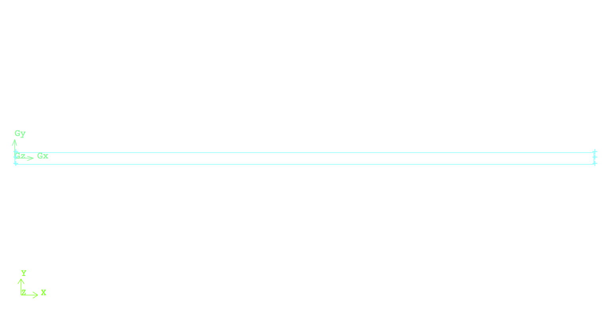
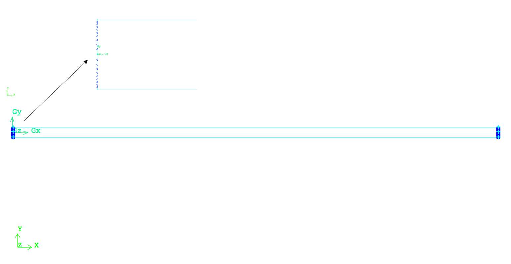
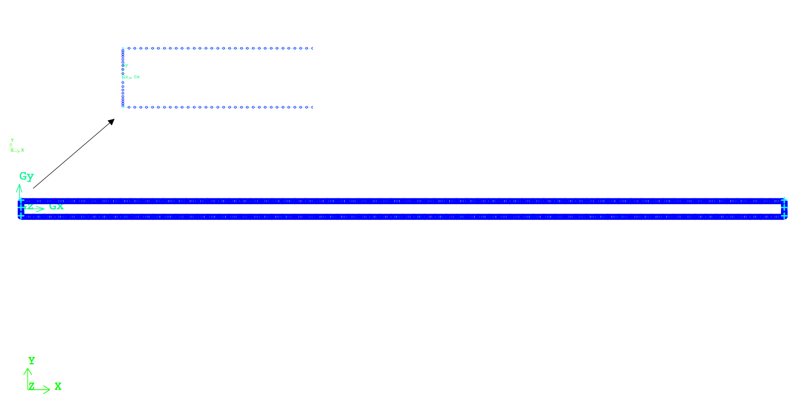
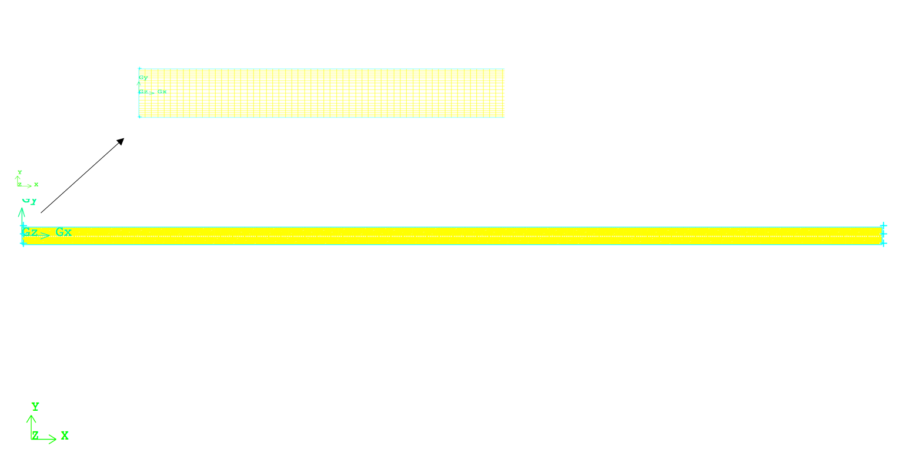

# CFD Domain's Creation & Discretization

**The next step for developing the CFD simulation for a case study, after the review of physics and theory behind the problem of interest, is to create the CFD/Computational domain. This CFD domain will first be created and then discretized into small finite elements (2D) or finite volumes (3D). The flow field's governing equations are then solved numerically inside these elements or volumes via an iterative process till a converged solution inside the CFD domain is obtained. This section explains the techniques and process of creation and discretization of the CFD domain for the problem of interest. It should be highlighted that this sections provides the most generic steps and techniques to create the CFD domain. Users can implement these steps/techniques in the mesher of their choice or download the pre-generated mesh from the current repository.**

The CFD domain for the 2D laminar flow in a rectangular pipe is a finite two dimensional rectangle. The dimensions of this pipe are defined according to the problem definition. For this specific problem the ratio of length to width is chosen to be 50 (i.e. L = 5 [m] , W = 0.1 [m]). This ratio guarantees a CFD domain with reasonable number of mesh elements. Furthermore, the pipe is long enough to simulate various aspects of the flow field as it evolves along the entrance length and becomes fully developed flow further downstream.

To create the CFD domain geometry with the above mentioned dimensions, it is recommended to start with generating the points on the corners of the rectangular pipe (i.e. four points) and two helping midpoints along pipe's width as shown in Fig. 1:

|x|y|
---|---|---
Vertex 1|0|0
Vertex 2|0|0.05
Vertex 3|0|-0.05
Vertex 4|5|0
Vertex 5|5|0.05
Vertex 6|5|-0.05

 
Fig.1 - Six base points, four corners and two helping midpoints, for creation of the CFD domain geometry.

Now connect these six points two-by-two to each other and create a the widths and lengths of the rectangular pipe. Using these lines define a united surface to form the full geometry of the rectangular pipe as shown in Fig 2.

 
Fig.2 - Raw geometry of the CFD domain for a two dimensional rectangular pipe.

After the CFD domain is created, it should be discretized into finite elements (a.k.a meshing). Technically, meshing is the process of "chopping" the CFD domain into small finite elements and/or volumes, wherein the flow field's governing equations will be solved numerically. High quality mesh elements lead to a smooth and promising numerical solution. Therefore, it is important to increase the level of controllability on the raw geometry from the first step by using helping surfaces on the raw geometry of the CFD domain. For example in this problem to increase the level of controllability on the meshing process, the width of the pipe was divided into two equal segments, using the helping midpoints. This discretization would provide a user full controllability on the mesh resolution close to the pipe's walls or it's center. Users can concentrate more points or defining a specific first length from the walls if a turbulent flow field needs to be simulated in future.

To mesh this CFD domain first each of the above-mentioned line segment on pipe's widths is divided into 10 mesh elements as shown on Fig.3. It should be noted that a first length of 3 [mm] as the width of the first mesh element was defined, when meshing each edge. The width for the rest of the mesh elements will be calculated using pre-defined distribution ratio in the mesher. This technique would concentrate more mesh element close to the channel walls to capture the physics of the laminar boundary layer. For the case of turbulent flow inside the pipe, when the complexity of flow field inside the boundary layer will increases, defining and controlling the mesh resolution in this area becomes significantly important. Therefore, upon mesh refinement requirement users just need to concentrate more nodes, by changing the pre-defined first length value, along the width close to the region of interest and re-mesh the edge and entire domain using the same algorithm that is used originally. However for the case of laminar flow controlling the mesh resolution in this region is not vital.

 
Fig.3 - Generated mesh elements along the pipe's widths. Notice the mesh concentration on the top and bottom edges close to the pipe's walls highlighted in the zoom-in view.

At this stage the two lengths of the pipe need to be meshed. The distribution of mesh element along each length is chosen to be uniform and 500 mesh elements. Mesh elements are created along each length, while the widths of each face was meshed in the previous step as shown in Fig. 4:

 
Fig.4 Generated edge mesh along the lengths of the CFD domain.

At this stage the entire CFD domain can be meshed using surface mesh algorithm of choice. This process will connect all predefined mesh element to each other and discretize the CFD domain as visualized in Fig. 5.

 
Fig.5 The mesh elements created using the surface mesh elements across the entire CFD domain.

Once the mesh is generated it's quality should be examined. This can be done using the provided features and functions defined in the meshing software. In general these functions calculate the aspect ratio of each elements and report a statistical report on them. The goal is to keep the average aspect ratio close to 1 for a very high quality mesh. In this stage the CFD domain is completely meshed and is ready to be setup for a CFD simulation.

The complete mesh file (.msh) can be downloaded from the current repository.
