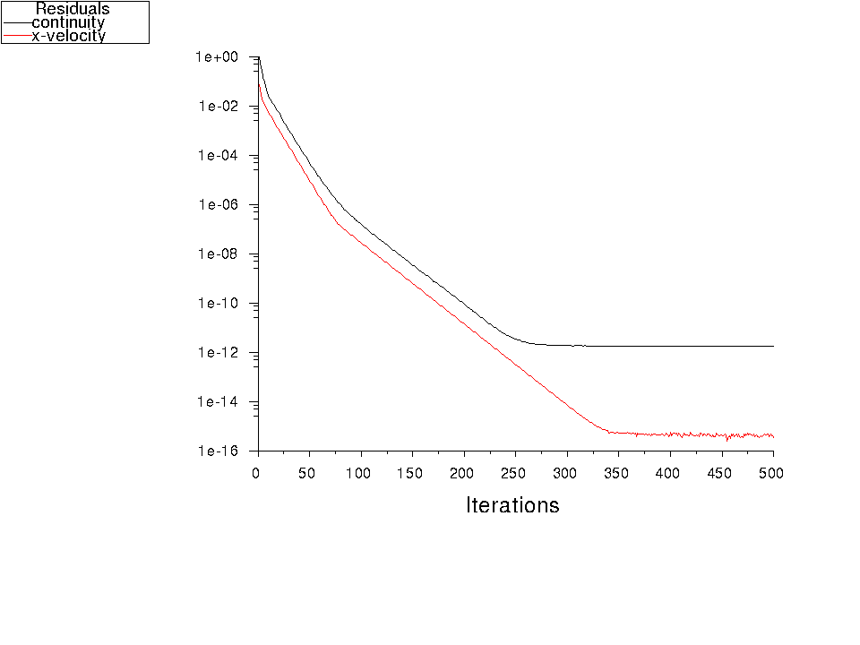
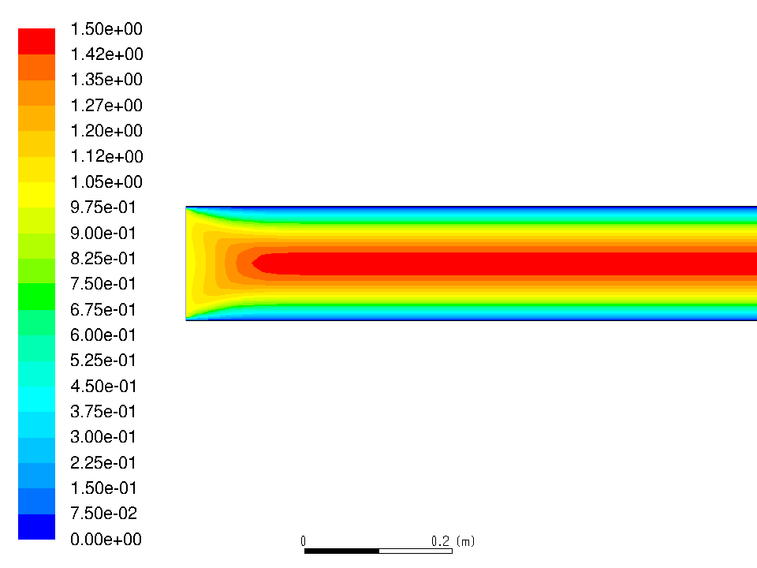
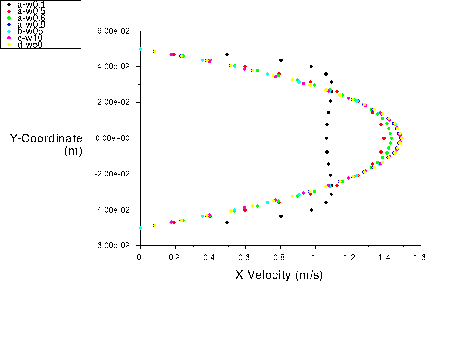
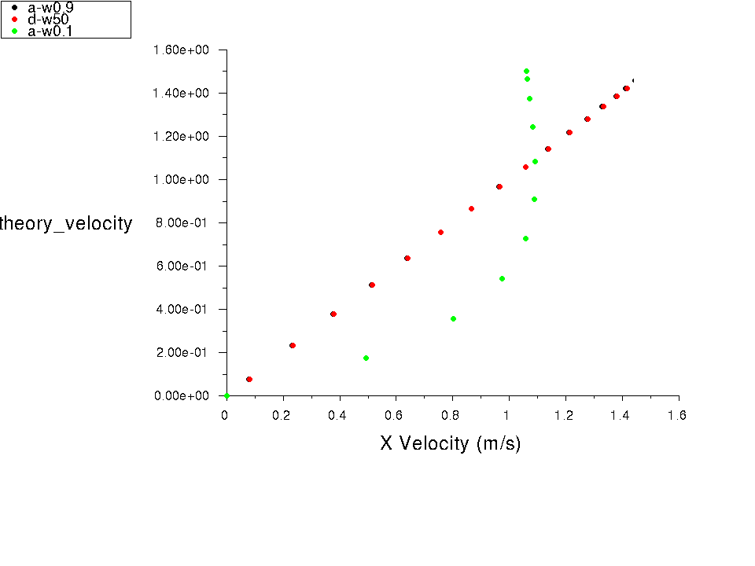

# CFD Results Post-Process

**The final step for the development of a CFD simulation for a problem of interest is to process and examine the validity of the obtained numerical results (a.k.a post-processing and validation step). This steps requires an in-depth engineering knowledge about the fundamentals of the physical problem of interest. Thus, the value of investing time in understanding the fundamental physics of the flow, once again is highlighted here. This process is done starting from general inspection on CFD simulation results and ends with more detail validation process.**

The first general rule of thumb to check the convergence of a CFD simulation is to visualize the residuals for key flow variables, such as continuity, velocity and etc.. In order to plot residual values in ANSYS FLUENT do: `plot/residual` and choose the residual values of interest to plot.

 
Fig.1 - Plotted residuals of continuity and streamwise velocity.

Figure 1 visualizes the residual values of continuity and streamwise velocity versus the number of iterations. The general decreasing trend of residual values confirm that the numerical solution of the conservation/governing equations are converging to specific final values. Usually the residuals for the continuity decrease with the slower rate compare to other residual values. Therefore, a continuity residual of 10E-3, is the first necessary but not sufficient general criteria to confirm the convergence of the CFD simulation in general. In this case this criteria is reached after about 50 iterations and after about 250 iterations the continuity residuals reached value of 10E-11, which is a solid confirmation of CFD simulation convergence.

The second step is to visualize dimensionless form of the important variables within the CFD domain. This step can be problem specific and should be done on an adequate plane of choice. For most of the problems contour of normalized velocity or pressure is on a horizontal or vertical plane at the center of the CFD domain is a good start point.
The path to define an adequate plane is `surface/plane-bounded`. However, in this case since the CFD domain is inherently two dimensional and planar, the entire CFD domain itself is a great candidate to be used for visualization of the flow field variables.

Once the plane of visualization is chosen user should define the normalized variable of interest. To define the normalized streamwise velocity, by the inlet velocity we will have `define/custom-field-functions/define`, name your variable (i.e. normalized_streamwise_velocity) and put the following formula `x_velocity/1`. This will calculate the normalized streamwise velocity within the CFD domain. At this stage the command `display/contour/normalized_streamwise_velocity` will ask you for a range (i.e. [0,1.5]) and visualizes the velocity contours for you as shown in figure 2:

 
Fig.2 - Contours of normalized streamwise velocity with the freestream velocity along firs few meters of the pipe (i.e. zoomed-in view).

As shown in this figure, the flow enters the domain with normalized velocity of 1. Due to the imposed no slip boundary conditions on the pipe's walls, the velocity instantly decrease to zero at this region. Due to this extreme change of momentum within the vertical direction there is going to be a region at the entrance of the pipe where the flow evolves in the streamwise direction. This specific length is referred to as the entrance length (as discussed earlier in Physics section). After the entrance length the velocity profile becomes fully developed and uniform to the end of the channel.
It should also be highlighted that this velocity contour is smooth. The smoothness confirms the validity of created mesh resolution and convergence of the numerical solution. However, this is an additional necessary, but not sufficient criteria for simulation validity and convergence.

**After performing the general post-processing steps, the user need to perform more detail oriented post-processing to confirm the validity of the CFD simulation. This stage can be a state-of-the-art. Comparing the numerical results against the theory (discussed earlier) or any other available experimental results is the final stage of post-processing. It is extremely important to calculate the correct corresponding numerical variables and compare them against the experimental or other numerical data.**

In order to visualize the evolution of the velocity along the flow one should look at the velocity magnitude at different stations downstream the pipe. Since the flow is axisymmetric each station is defined as a vertical line at different distances downstream the pipe. One can use `surface/line-surface` command to enter the start and end point of each measurement station as shown in the following table, where `W` is the width of the rectangular pipe and `x` is the multiplier to define the distance downstream the inlet:

|x(0)|y(0)|
|---|---
|x*w|-0.05

|x(1)|y(1)|
|---|---
|x*w|+0.05

Here `x` values are chosen to be 0.1, 0.5, 0.6, 0.9, 5, 10 and 50. These `x` values will help users to visualize the evolution of the velocity field within entrance length and across the pipe toward it's end. Furthermore, it shows the numerically predicted entrance length. It should be noted the first four values are chosen based on the prior experimental approximation of the entrance length, which for this problem is 0.09 [m]. In order to plot the streamwise velocity variables at the defined stations along the length of the pipe use `plot/plot` command or `plot/XY Plot` in GUI and choose the variables of choice on each pre-defined downstream station to visualize the results. <Add the details of the step in future.>

 
Fig.3 - Evolution of the streamwise velocity along the pipe at various downstream stations.

Figure 3 visualize the numerically predicted streamwise velocity profiles along the pipe at 0.1, 0.5, 0.6, 0.9, 5, 10 and 50 pipe's width downstream the inlet. Right after the inlet, 0.1*w=0.01 [m] downstream the inlet, velocity profile is shown with black dots. This profile has a skewed bell shape and is not even close to the discussed parabolic velocity profile in the Physics section! However, moving further downstream, at 0.5*w=0.06 [m] downstream the inlet, velocity profiles starts to get a parabolic shape as shown by red dots in Fig. 3. This evolution continues to happen until the 0.9w station downstream the inlet. After this station the velocity profile gets fully developed and does not evolve anymore. Therefore the plotted velocity profiles fall right on top of each other at further downstream stations. Hence, user can conclude that these numerical results predicted entrance length of 0.9*w=0.09 [m] matches the experimental approximation of the entrance length discussed in Physics section. As a kind reminder the empirical relation was as follows:

**Le** **= 0.05** . **Rew** . **Dh**

Where **Rew** is the Reynolds number of the pipe based on the pipe's width. **Dh** is the hydraulic diameter of the pipe considering unit depth as defined as **Dh** **=4 . A/P**. Here **A** and **P** are area and perimeter of the pipe's rectangular inlet. For this simulation:

**Le** **= 0.05** . **10** . **4.(0.1)/2(1+0.1)=0.09 [m]**

As the final step for validation one can compare the numerically predicted fully developed velocity profile against the theoretically derived equation parabolic velocity profile. To define the theoretical fully developed velocity profile use `define/custom-field-functions/define`, name your variable (i.e. theory_velocity) and put the following formula `1.5 * (1-((2*y-coordinate)/0.1)^2)`. In this formula 1.5 is the maximum centerline velocity as shown in the previous results. This will calculate the theoretical fully developed velocity profiles within the CFD domain.

Now users can plot the numerically predicted streamwise velocity (X velocity) versus the calculated theoretical velocity at the 0.1w, 0.9w and 50w down stream stations. For plotting these results us `plot/plot` command or `plot/XY Plot` in GUI and choose the variables of choice on each pre-defined downstream station to visualize the results. <Add the steps of plotting in future>. Fig. 4 visualize the comparison between numerically predicted velocity profiles and theoretically calculated ones at various downstream stations. As shown in Fig.4 the functionality between these two velocities at downstream stations 0.9w and 50w, shown as black and red dots, are linear and the slope of this line is equal to one. This means that both velocity profiles completely match each other. However, within the entrance region this functionality, shown as green dots, is not linear anymore. This highlights the limitation of theoretical calculation to define velocity profile within the entrance length of the pipe.

For a practice users are encourage to visualize the full theoretical and numerical velocity profiles to confirm the above-comparison. This can be done via `plot` command. Users first need to store the data at each station down stream to a file and then visualize them on top of each other. Give it a try!

At this stage one can conclude that this CFD numerical simulation is validated to study 2D laminar flow in a rectangular pipe. Therefore, it can be used for similar or more complex problems, such as flow with specified pressure gradient, non-uniform velocity profiles and etc.. This can be done via correct implementation in changing the corresponding boundary conditions.
