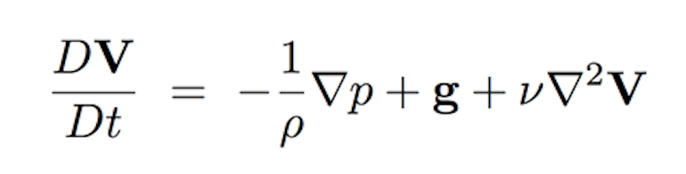
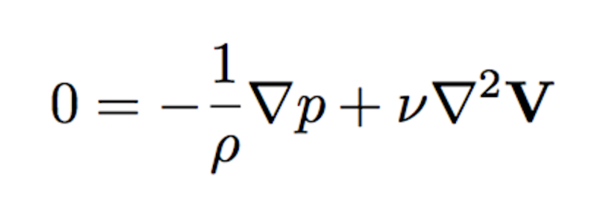
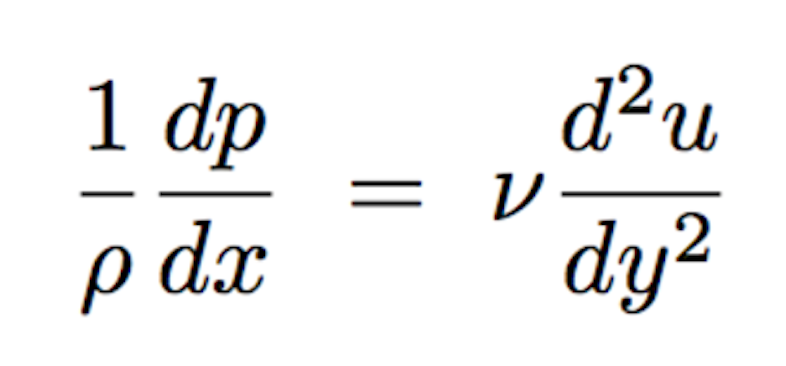
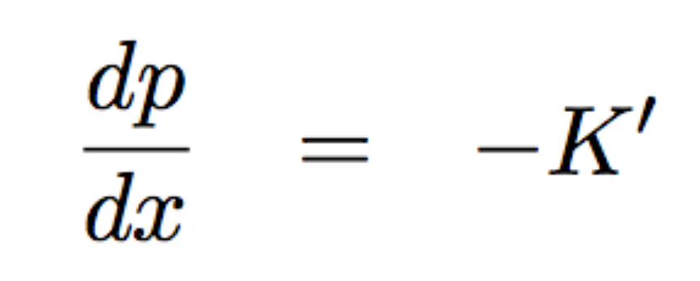
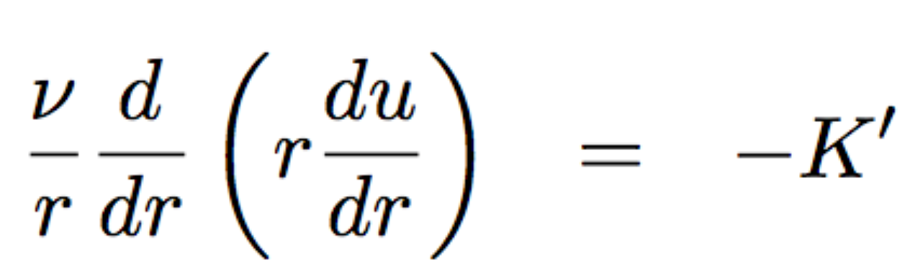
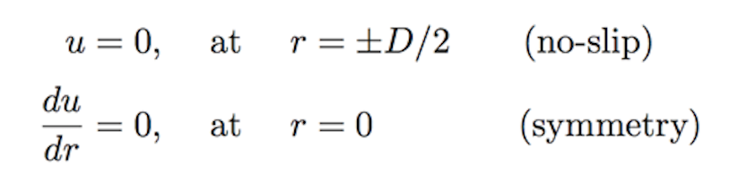
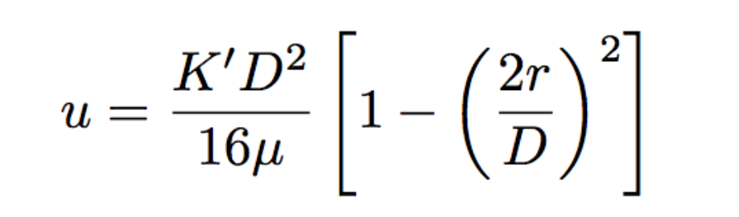
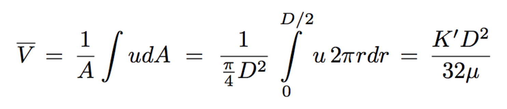
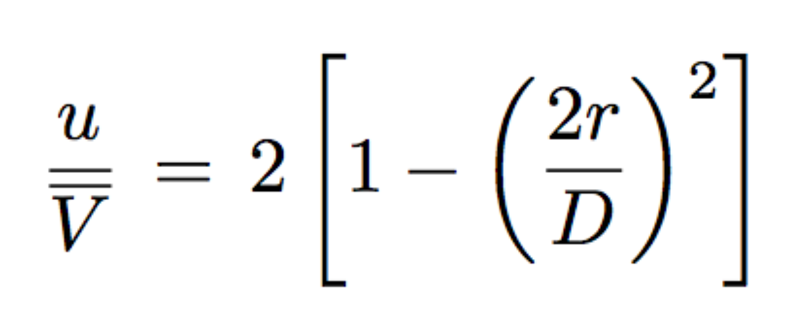
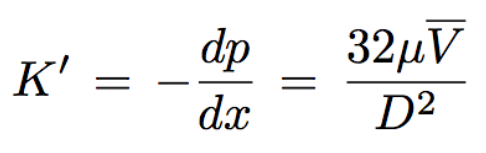

# CFD Problem's Physics & Theory

**In developing CFD simulation for a fluid mechanic problem understanding the general physics and fundamental theory of the problem is extremely important. This knowledge would provide users the ability to make logical decision about the geometry of CFD domain, choice of proper boundary conditions and numerical models for the CFD simulation. Furthermore, user will have a general big picture on the expected outcome of simulation. These knowledges and abilities form the foundation for a successful implementation and validation of the CFD simulation.**

**In other words understanding physics and theory of problem before developing a CFD simulation can be thought as turning a flash light on before taking any step in a completely dark room. Hence, let's review the fundamental physics and theory behind the problem of "2D Laminar Flow in a Rectangular Pipe." as the first step for development and validation of CFD simulation for this problem of interest:**

The general form of the Navier-Stokes equation is as follows:

This equation indicates that the material derivative of the velocity field (i.e. the summation of external forces per unit mass in a Lagrangian reference frame) is balanced with the summation of pressure, body and viscous forces per unit mass within the flow field (i.e. forces in Eulerian reference frame). For the case of laminar flow in a pipe, in most of the engineering applications the incoming flow into the pipe has an almost constant and uniform velocity. However, it is probable that the incoming flow velocity has some temporal fluctuations. In these cases these fluctuations should be estimated to declare the degree of steadiness of the flow. In generic cases the assumption of steady/uniform flow or flow with minor temporal fluctuations is a reasonable assumption. Furthermore, considering a horizontal pipe flow, the effect of body forces can become negligible. Applying these two assumptions the Navier-Stokes equation will be reduced to:

Once the flow enters the pipe due to the no slip boundary conditions at the walls of the pipe fluid velocity will instantly become zero. This results into a strong velocity gradient across the entrance length of the pipe and effects the velocity field in this region. This interaction between fluid element and solid walls forms a thin layer at the boundary of solid and fluid called `Boundary Layer`. In this region the flow field behavior is complex. Moving further downstream the two boundary layers, at pipe's top and bottom walls, merge with each other and the velocity gradient becomes smoother. The velocity profile get a parabolic shape and the flow becomes `fully developed`. This short region is referred to as the `entrance region`. The length of this region for laminar flows is experimentally related to the Reynolds number and hydraulic diameter of non-circular (i.e. rectangular) pipe as follows:

**Le** **= 0.05** . **Rew** . **Dh**

Where **Rew** is the Reynolds number of the pipe based on the pipe's width. **Dh** is the hydraulic diameter of the pipe considering unit depth defined as **Dh** **=4 . A/P**. Here **A** and **P** are area and perimeter of the pipe's rectangular inlet respectively. More physical explanation on the concept of entrance length is available [here](https://en.wikipedia.org/wiki/Entrance_length#Entry_Length). <Maybe replace the link with more solid ref.>

For a fully developed flow, it can be assumed that the pressure field variation in any directions other than the streamwise direction (i.e. x-direction in this problem) will become negligible. Furthermore, the change in the streamwise velocity is only significant across the pipe's cross section (i.e. y-direction) due to the no slip boundary conditions at the bottom and top walls of the pipe. Applying these assumptions the Navier-Stokes equation can be further reduced to:

In order to solve the above equation, to obtain the general velocity profile and pressure drop across the pipe we consider:

In the above equations K' is a constant and the negative sign implies the pressure drop across the pipe. Integration of this equation will result into the general velocity profiles with two constant values. Applying two of the the following boundary conditions in the flow field would lead into a determined system of two equations and two unknowns and gives values for C1 and C2.

The general form of velocity profile will be as follows:

In this equation K' is the only undefined constant. Considering the average velocity across the cross section of the duct one can write:

As a result of this algebraic manipulation the general form of velocity profile and pressure gradient across the pipe will be as follows:

This derivation shows that the velocity profile is complex within the entrance length of the pipe. Once it becomes fully developed, it will get a fixed parabolic shape with a defined equation that satisfies all physical boundary conditions of the flow. With this review one has developed an in-depth understanding of the flow and approximate the expected results from the CFD simulations. Now one can move forward to initiate developing the CFD domain and simulations for this problem of interest.

> For more details on the physics, theory and equation derivation please see chapter 8 of "A Physical Introduction to Fluid Mechanics by Alexander J. Smits" 2nd edition. [Download Book Here!](http://www.efluids.com/efluids/books/efluids_books.htm)
